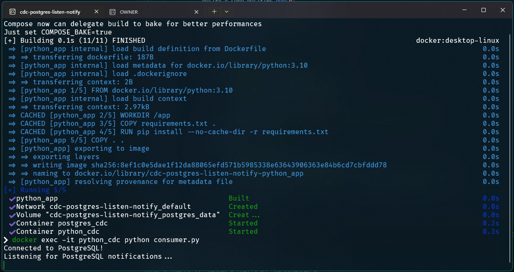
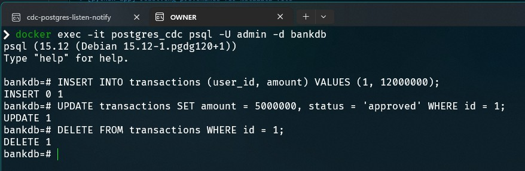
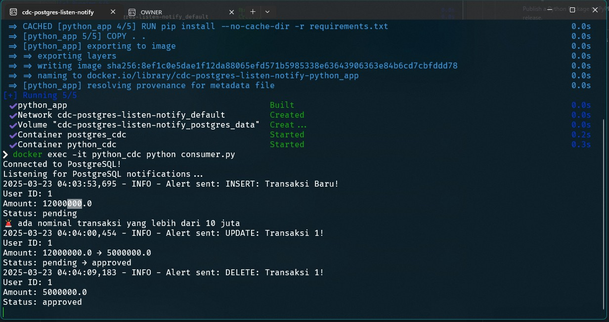

## How to run

```
docker compose up -d --build
docker exec -it python_cdc python consumer.py
```



## DML to trigger notification
Open new tab on your terminal and type these

```
docker exec -it postgres_cdc psql -U admin -d bankdb
```

### INSERT

```
INSERT INTO transactions (user_id, amount) VALUES (1, 12000000);
```

### UPDATE

```
UPDATE transactions SET amount = 5000000, status = 'approved' WHERE id = 1;
```

### DELETE
```
DELETE FROM transactions WHERE id = 1;
```



### Result




## How to stop
```
docker compose down -v
```